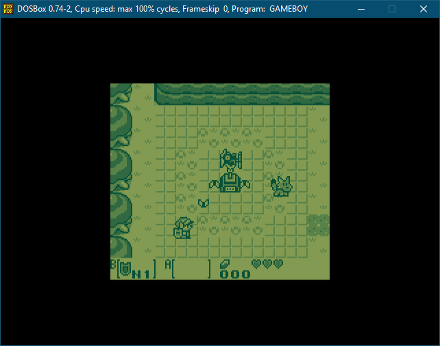

# Game Boy emulator for DOS

## Limitations

It's not the most accurate out there, but it's good enough to run most games
faithfully. What's note worthy is the emphasis on speed, leveraging as much
hardware acceleration as possible for graphics and sound, by mapping the
Game Boy PPU to the EGA/VGA hardware as much as possible, and emulating the
Game Boy audio synth with the OPL FM synth of the Adlib/Sound Blaster.

It's possible to map most of the Game Boy graphics and sound to common PC
hardware, which make things efficient, but some exceptions exist, which
explains why the emulation isn't perfect.

For example, the Game Boy color palettes (background and sprites) are handled
with hardware palette, allowing to avoid decoding and converting pixels
altogether, but as screen scanning is not perfectly synchronous between the
emulated hardware and the real screen, games that change palette mid screen
won't have the right colors applied to the right screen portions. So the
emulator sets the palette only once per frame, which works perferctly fine for
most games. For the very rare games or demoscenes it breaks, it has the
advantage of being consistent instead of palettes being applied to random
portions of the screen.

For sound, the Game Boy synth, although simple, has features not found in any
PC synthesizers, such as a custom waveform channel, or pulse waves with
varying duty cycle. It's possible to reproduce the pulse waves and the
different duty cycles of the Game Boy with the FM synthesis of an OPL2, but the
custom waveform channel is replicated with a generic bass. The OPL2 also lacks
control over the noise it can generate and can't generate the low frequency or
low pitch noise of the Game Boy.

The emulator also support the synthesizer found in the Tandy 1000/PCjr, which
is very close to the Game Boy synth, but only features square waves, and the
noise channel is less flexible than the one of the Game Boy.

That said, relying on the hardware to handle most of the sound and graphics
alleviate the CPU of these heavy operations, which make it possible to run any
game at full speed on any Pentium class computer, or even a fast 486.

## Usage

Enter GAMEBOY followed by the ROM file you want to run. If no ROM is provided,
or if it's not found, the default Tetris game will run. For other options,
type GAMEBOY /?

## Build

A Makefile is provided to be used with [DJGPP 2](https://www.delorie.com/djgpp/).

## Hardware

| | Minimum | Recommended |
|-|---------|-------------|
| CPU | 386SX | Pentium |
| RAM | 4MB | 8MB |
| Video | VGA | VGA |
| Sound | - | Adlib/Sound Blaster |

## Key Mapping

X       : A 
C       : B 
RShift  : Start 
Space   : Select 
Arrows  : D-pad 
F1 to F4: Enable sound channel 1 to 4 
F5 to F8: Disable sound channel 1 to 4 
F9      : Change colors 
Esc     : Quit

______________________
Gael Cathelin (C) 2025